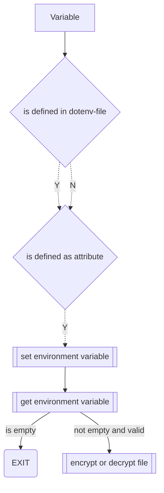
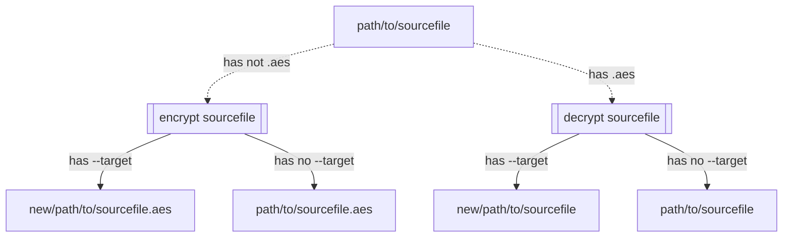

<div id="top" align="center">
<h1>file encryption/decryption</h1>

<h4>File encryption and decryption (shell/commandline)</h4>
<h6>for Linux, MacOS, Windows</h6>

[Report Issue](https://github.com/Zheng-Bote/qt-cli_file_encryption-decryption/issues) [Request Feature](https://github.com/Zheng-Bote/qt-cli_file_encryption-decryption/pulls)

[](https://choosealicense.com/licenses/mit/)
[](https://github.com/Zheng-Bote/qt-cli_file_encryption-decryption/releases)

</div>

<hr>

<!-- START doctoc generated TOC please keep comment here to allow auto update -->
<!-- DON'T EDIT THIS SECTION, INSTEAD RE-RUN doctoc TO UPDATE -->

**Table of Contents**

- [Description](#description)
  - [Features](#features)
- [Status](#status)
- [Documentation](#documentation)
  - [Usage](#usage)
    - [Rules](#rules)
  - [Encryption](#encryption)
    - [Linux](#linux)
  - [Decryption](#decryption)
    - [Linux](#linux-1)
  - [configuration: dotenv or env](#configuration-dotenv-or-env)
  - [Test / Performance](#test--performance)
- [Installation](#installation)
  - [Linux](#linux-2)
  - [MacOS](#macos)
  - [Windows](#windows)
- [Development](#development)
  - [Dependencies](#dependencies)
    - [CMake](#cmake)
    - [QT](#qt)
    - [Qt-AES](#qt-aes)
    - [dotenv-cpp](#dotenv-cpp)
  - [folder structure](#folder-structure)
- [Authors and License](#authors-and-license)
  - [MIT License](#mit-license)
  - [Authors](#authors)
    - [Code Contributors](#code-contributors)

<!-- END doctoc generated TOC please keep comment here to allow auto update -->

<hr>

# Description


Qt6 C++23 shell/commandline application to encrypt / decrypt the given file.

- Encryption: AES-256 CBC
- Password: SHA256, between 5 to 32 characters
- initialization vector: MD5

## Features

- [x] encrypt/decrypt every readable file (binary-mode, chunk size 4MB)
- [ ] i18n

- [x] runs on DOS/Windows (shell/commandline)
- [x] runs on MacOS (cli)
- [x] runs on Linux (cli)
- [ ] runs on iOS
- [ ] runs on Android
- [ ] runs on HarmonyOS
- [ ] supports pipe operator or arguments
- [x] supports arguments and dotenv file

- [x] OSS and license
- [x] works as designed
- [ ] no bugs

- [x] some more or less usefull Github Actions for GH-repo, GH-pages, GH-wiki, CI/CD-Pipelines
- [ ] Packagemanager
- [x] Buildsystem: CMake
- [x] Installation routine (no Adminstrator rights needed)
- [ ] portable application

<p align="right">(<a href="#top">back to top</a>)</p>

# Status


[](https://github.com/Zheng-Bote/qt-cli_file_encryption-decryption/releases)


# Documentation

## Usage

```cli
file_encryption-decryption-x86_64 -h

cli app to encrypt and decrypt a given file
Usage:
  qt-cli_file_encryption-decryption [OPTION...]

  -s, --source arg  <path/to/sourcefile> to en-/de-crypt. Mandatory: -s | -d
  -t, --target arg  target <path/to/outputfile>. Optional: -t | -d
  -p, --pwd arg     name of password env variable. Mandatory: -p | -d
  -d, --dotenv arg  <path/to/dotenv> file. Mandatory: -s | -p | -d
  -h, --help        Print help
```

### Rules

**dotenv-file vs env variables**

The program works with given arguments and/or given dotenv-file.

- if an entry is not defined (dotenv-file, environment variable, argument), the program exit with failure
- a given argument overwrites a dotenv-file entry
- if a given dotenv-file entry is missing, the program looks for the related environment variable



**encryption or decryption**

- if sourcefile given without a targetfile and sourcefile has not extension `.aes`, the targetfile will be encrypted as `<samePath>/<sourcefile>.aes`
- if sourcefile has extension `.aes` without a targetfile, the targetfile will be decrypted `<samePath>/<sourcefile>` (without extension `.aes`)



## Encryption

> \[!WARNING]
> don't loose your password. Decryption/Recovery without valid password is impossible!

### Linux

**encrypt**

Encrypt `/path/to/sourcefile.xlsx` to `/path/to/sourcefile.xlsx.aes` with environment password-variable `my_secret_var`

```cli
./file_encryption-decryption-x86_64.AppImage --source /path/to/sourcefile.xlsx --pwd my_secret_var
```

Encrypt `/path/to/sourcefile.xlsx` to `/new/path/to/targetfile.xlsx.aes` with dotenv-file (`PWD=$my_secret_var`)

```cli
./file_encryption-decryption-x86_64.AppImage --source /path/to/sourcefile.xlsx --target /new/path/to/targetfile.xlsx --dotenv /my/configpath/.file_enc-dec
```

## Decryption

### Linux

**decrypt**

Decrypt `/path/to/sourcefile.xlsx.aes` to `/path/to/sourcefile.xlsx`

```cli
./file_encryption-decryption-x86_64.AppImage --source /path/to/sourcefile.xlsx.aes
```

Decrypt `/path/to/sourcefile.xlsx.aes` to `/new/path/to/targetfile.xlsx`

```cli
./file_encryption-decryption-x86_64.AppImage --source /path/to/sourcefile.xlsx.aes --target /new/path/to/targetfile.xlsx
```

## configuration: dotenv or env

Example dotenv file `.env`

```dotenv
SOURCE_FILE=/inpath/to/file.xlsx    # Mandatory or mandatory via argument --source
TARGET_FILE=/outpath/to/file.xlsx   # Optional or optional via argument --target
PWD=my_env_secret                   # Mandatory get password from $my_env_secret or mandatory via --pwd my_env_secret
```

Example pwd environmwent variable

```cli
export PWD="top_secret_password"
```

## Test / Performance

**tested on**

- x86_64 Ubuntu 24.04.2 LTS
- Intel(R) Core(TM) i5-9600K CPU @ 3.70GHz with 6 cpu cores
- average SSD storage
- fallocate -l 1G test.img

**read / write binary mode of 1 GB file with a chunk size of 4 MB**
| type | val |
| ---- | --------- |
| real | 5m52,734s |
| user | 5m49,905s |
| sys | 0m2,391s |

**read / write binary mode of 1 GB file with a chunk size of 16 MB**
| type | val |
| ---- | --------- |
| real | 5m50,753s |
| user | 5m48,691s |
| sys | 0m2,049s |

=> so compiled chunk size is 4 MB to give better feedback about the process status.

<p align="right">(<a href="#top">back to top</a>)</p>

# Installation

## Linux

- make AppImage executable (eg. `chmod 755 file_encryption-decryption-x86_64.AppImage` )
- execute AppImage

## MacOS

- make DiskImage executable (eg. `chmod 755 file_encryption-decryption.dmg`)
- execute / double-click on the `.dmg` file. A window should appear showing the program you are installing and the Applications Folder.
- drag the program into the Applications Folder; macOS will automatically install the software for you.

## Windows

_under construction_

# Development

## Dependencies

> \[!NOTE]
> All licenses are therefore Open Source.

### CMake

CMake: A Powerful Software Build System

[](https://github.com/conan-io/conan)
[](https://choosealicense.com/licenses/bsd-3-clause/)

### QT

> \[!NOTE]
> _QT6 - Community Edition_ >= 6.7

The Qt framework contains a comprehensive set of highly intuitive and modularized C++ library classes and is loaded with APIs to simplify your application development. Qt produces highly readable, easily maintainable and reusable code with high runtime performance and small footprint – and it's cross-platform.

[](https://www.qt.io/download-open-source)
[](https://choosealicense.com/licenses/lgpl-3.0/) _see also:_[Obligations of the GPL and LGPL](https://www.qt.io/licensing/open-source-lgpl-obligations)

### Qt-AES

Small and portable AES encryption class for Qt. Native support for all key sizes - 128/192/256 bits - ECB, CBC, CFB and OFB modes for all key sizes partial AES-NI support

[](https://github.com/bricke/Qt-AES)
[](https://github.com/bricke/Qt-AES?tab=Unlicense-1-ov-file)

### dotenv-cpp

An utility to load environment variables from a .env file

[](https://github.com/laserpants)
[](https://choosealicense.com/licenses/bsd-3-clause)

<p align="right">(<a href="#top">back to top</a>)</p>

## folder structure

<!-- readme-tree start -->
```
.
├── .github
│   ├── actions
│   │   └── doctoc
│   │       ├── README.md
│   │       ├── action.yml
│   │       └── dist
│   │           ├── index.js
│   │           ├── index.js.map
│   │           ├── licenses.txt
│   │           └── sourcemap-register.js
│   └── workflows
│       ├── ghp-call_Readme.yml
│       ├── ghp-create_doctoc.yml
│       ├── ghp-markdown_index.yml
│       ├── repo-actions_docu.yml
│       ├── repo-call_Readme.yml
│       ├── repo-create_doctoc.yml_
│       ├── repo-create_doctoc_md.yml
│       └── repo-create_tree_readme.yml
├── .gitignore
├── LICENSE
├── README.md
├── docs
│   └── dot.env
├── src
│   ├── .gitignore
│   ├── CMakeLists.txt
│   ├── configure
│   │   ├── ClangTidy.cmake
│   │   ├── Doxygen.cmake
│   │   ├── extra_headers
│   │   └── rz_config.h.in
│   ├── includes
│   │   ├── cxxopts.hpp
│   │   ├── dotenv.h
│   │   ├── qaesencryption.cpp
│   │   ├── qaesencryption.h
│   │   ├── rz_config.h
│   │   ├── rz_options.h
│   │   ├── rz_qt-aes.h
│   │   └── rz_snippets.h
│   └── main.cpp
└── tree.bak

10 directories, 34 files
```
<!-- readme-tree end -->

<p align="right">(<a href="#top">back to top</a>)</p>

# Authors and License

## MIT License

[](https://choosealicense.com/licenses/mit/)

Copyright (c) 2025 ZHENG Robert

Permission is hereby granted, free of charge, to any person obtaining a copy
of this software and associated documentation files (the "Software"), to deal
in the Software without restriction, including without limitation the rights
to use, copy, modify, merge, publish, distribute, sublicense, and/or sell
copies of the Software, and to permit persons to whom the Software is
furnished to do so, subject to the following conditions:

The above copyright notice and this permission notice shall be included in all
copies or substantial portions of the Software.

THE SOFTWARE IS PROVIDED "AS IS", WITHOUT WARRANTY OF ANY KIND, EXPRESS OR
IMPLIED, INCLUDING BUT NOT LIMITED TO THE WARRANTIES OF MERCHANTABILITY,
FITNESS FOR A PARTICULAR PURPOSE AND NONINFRINGEMENT. IN NO EVENT SHALL THE
AUTHORS OR COPYRIGHT HOLDERS BE LIABLE FOR ANY CLAIM, DAMAGES OR OTHER
LIABILITY, WHETHER IN AN ACTION OF CONTRACT, TORT OR OTHERWISE, ARISING FROM,
OUT OF OR IN CONNECTION WITH THE SOFTWARE OR THE USE OR OTHER DEALINGS IN THE
SOFTWARE.

## Authors

- [](https://www.github.com/Zheng-Bote)

### Code Contributors


[](https://www.github.com/Zheng-Bote)

<hr>

:vulcan_salute:

<p align="right">(<a href="#top">back to top</a>)</p>
